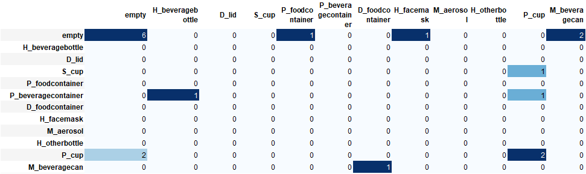

# Model Evaluations

A commonly used metric for performance is mean average precision (mAP) which is single number used to summarize the area under the precision-recall curve. mAP is a measure of how well the model generates a bounding box that has at least a 50% overlap with the ground truth bounding box in our test dataset. Below are the results, one of the top mAP and mAR value faster rcnn models trained on a mix of synthetic and real data using 100% Synthetics and 0% real, to 50% Synthetic and 50% reat, etc. mAP values range from 0-1, the higher the better.

## Results

For each of the pre-category the metrics can be read as `precision_@0.5IOU` / `recall_@0.5IOU`, all running on the a validation set of images unseen. 
                                            
| Experiment / Category  | beveragebottle | beveragecan |
|------------------------|----------------|-------------|
| Synth 100 Real 0       | 0.75 / 0.3     | 0.22 / 0.5  |
| Synth 0 Real 100       | 0.75 / 0.3     | 0.0 / 0.0   |
| Synth50 Real 50        | 0.75 / 0.6     | 0.5 / 0.5   |
| Synth 70 Real 30       | 0.71 / 0.5     | 0.29 / 0.5  |


For the Synth50/Real50 model appeared to have higher precision and recall on the __High_res_validation_set__. Below is the output of the confusion matrix used to evaluate the performance of the trained model using mAP. The matrix results can be interpreted as such:

- The Horizontal rows represent the ground truth values (e.g., what the model should have predicted).
- The vertical columns represent the predicted values (e.g., what the model actually predicted)
- Each row and column correspond to each one of the classes supported by the model.
- The final row and column correpsond to the class "nothing" which is used to indicate when the object of a specific class was "not detected", or an object hat was detected wasn't part of the ground-truth





Please refer to `Notebooks/confusion_matrix_eval.ipynb` for additional details. 

----
# Demo

_Optional_ the soft link eval directory has been mounted as csiro_eval by `ln -s /mnt/csiro_trashnet/experiments/tfodapi/ds2/csiro_eval csiro_eval`


## Data prep


1. For custom validation set that is unlabel you can custom annotation using [labelImg](https://github.com/tzutalin/labelImg)

2. After labels complete, transform image annotations from individual files of `.xml` to one `.csv` using `labelimg_xml_to_csv.py` + folder of annotated images

```
python labelimg_xml_to_csv.py csiro_eval/high_res_validation_set/
```

3. create tfrecords
```
CSV=csiro_eval/high_res_validation_set/_xml_to_csv_labels.csv
IMG_DIR=csiro_eval/high_res_validation_set/
OUT=csiro_eval/tfrecords/stormwater_vids.tfrecord
python csv_to_tfrecord.py --csv_input ${CSV}  --image_dir ${IMG_DIR} --output_path ${OUT}
```


## Confusion Matrix Evaluation on Each Class

To run this script you need a couple of things:

4. The label map used by your model — This is the proto-buff file that you created in order to train your model.

5. A detection record file — This is the file generated by using the ```/object_detection/inference/infer_detections.py```. This script runs a TFRecord file through your model and saves the results in a detection record file.

To generate the detection record for the trained model use the path above with the following:
```
#frcnn_r50_ds2_storm_111620_step10k
#frcnn_ds2s_Syn50Rea50_111720_step16k

MNT=csiro_eval
MODEL=frcnn_ds2s_Syn50Rea50_111720_step16k
TFRECORD_PATH=$MNT/tfrecords/stormwater_vids.tfrecord
DETECTION_TFRECORD_PATH=$MNT/tfrecords/test_detection.tfrecord
INFERENCE_GRAPH_PATH=$MNT/$MODEL/frozen_inference_graph.pb

python ~/repos/models/research/object_detection/inference/infer_detections.py \
    --input_tfrecord_paths=${TFRECORD_PATH} \
    --output_tfrecord_path=${DETECTION_TFRECORD_PATH} \
    --inference_graph=${INFERENCE_GRAPH_PATH}

```


Once you have the `infer_detection.py` results, we can run the `confusion_matrix.py` to generate the confusion matrix. Here is an example of running the script:
```
LABELMAP_PATH=$MNT/labelmap.pbtxt
CONFUSION_MATRIX_PATH=$MNT/$MODEL/confusion_matrix.csv

python confusion_matrix.py --detections_record=${DETECTION_TFRECORD_PATH} --label_map=${LABELMAP_PATH} --output_path=${CONFUSION_MATRIX_PATH}

```

The script will print the confusion matrix along with precision and recall information to the standard output.

